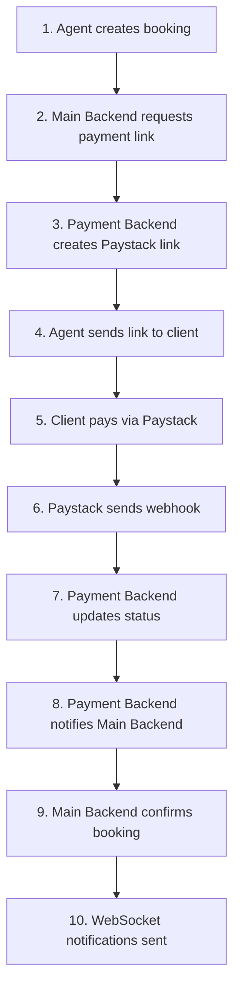

# Property Booking Payment Backend

A dedicated payment processing backend service for the property booking platform, handling payment operations through Paystack integration.

## Table of Contents
- [Features](#features)
- [Prerequisites](#prerequisites)
- [Installation](#installation)
- [Configuration](#configuration)
- [Usage](#usage)
- [API Documentation](#api-documentation)
- [Payment Flow](#payment-flow)

## Features
- Payment link generation via Paystack
- Webhook handling for payment notifications
- Payment status tracking and updates
- Secure payment verification
- Integration with main booking platform
- Real-time payment notifications

## Prerequisites
- Node.js (v14 or higher)
- MongoDB
- Paystack account and API keys

## Installation
1. Clone the repository
2. Install dependencies:
   ```bash
   npm install
   ```
3. Create a `.env` file in the root directory

## Configuration
Set up your environment variables in `.env`:
```env
PORT=3001
MONGODB_URI=your_mongodb_uri
PAYSTACK_SECRET_KEY=your_paystack_secret_key
PAYSTACK_PUBLIC_KEY=your_paystack_public_key
MAIN_BACKEND_URL=your_main_backend_url
WEBHOOK_SECRET=your_webhook_secret
```

## Usage
Development mode:
```bash
npm run dev
```

Production mode:
```bash
npm start
```

## API Documentation

### Payment Links
- `POST /api/payments/create-link`
  - Create a payment link for a booking
  - Required fields: `amount`, `email`, `bookingId`

### Webhooks
- `POST /api/webhooks/paystack`
  - Handles Paystack payment notifications
  - Requires Paystack signature verification

### Payment Status
- `GET /api/payments/:paymentId`
  - Retrieve payment status
- `GET /api/payments/booking/:bookingId`
  - Get payment details by booking ID

## Payment Flow

